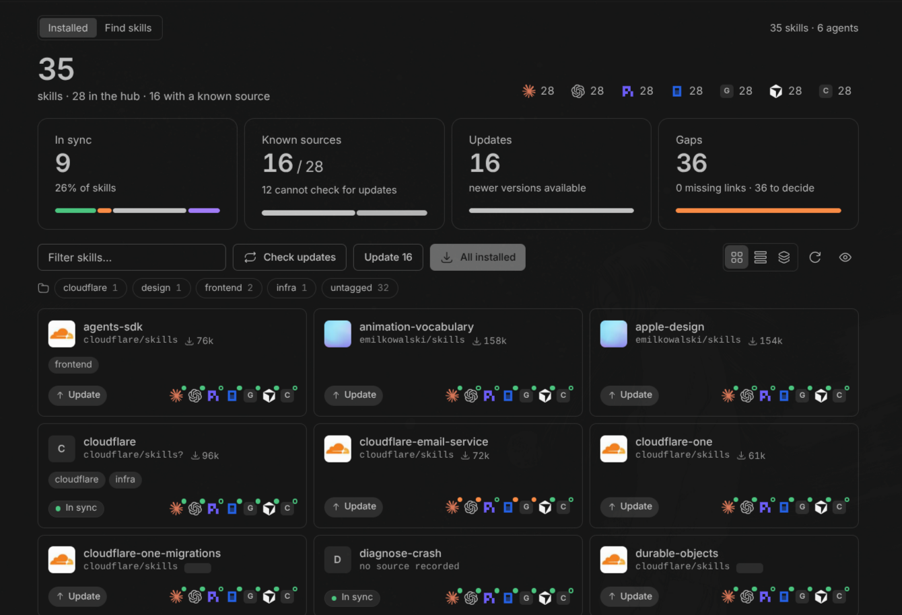

<p align="center">
  
</p>

<h1 align="center">Skill Manager</h1>

<p align="center"><strong>All your agent skills, one place, inside BB.</strong></p>

<p align="center">
  <a href="https://github.com/sankalpaacharya/bb-skill-manager/releases"></a>
  <a href="LICENSE"></a>
  <a href="https://skills.sh"></a>
</p>

<p align="center">
  
</p>

Claude Code, Codex, Pi, OpenCode, Gemini, Cursor, Copilot. Each one keeps its own skills folder, so you end up with the same skill copied everywhere and slowly going out of sync.

Skill Manager fixes that. One hub, every agent linked to it, updates in one click.

## Install

```sh
bb plugin install git:https://github.com/sankalpaacharya/bb-skill-manager.git
```

Then open **Skills** in the sidebar.

## What you get

- One hub for every skill, every agent linked to it
- See which agent has what, and what drifted
- Search skills.sh and install into the agents you pick
- Knows where each skill came from, tells you when there's an update
- Tags, grouping by source, read any skill in place
- Your agents can run all of it with `bb skill-manager`

## CLI

```sh
bb skill-manager status
bb skill-manager search react
bb skill-manager install mattpocock/skills@code-review --all-agents
bb skill-manager check
bb skill-manager update
bb skill-manager sync impeccable --to codex,pi
bb skill-manager doctor
```

Run `bb skill-manager` for the full list. Nothing destructive happens without `--force`.

## Settings

`bb plugin config skill-manager`

| Key | Default |
| --- | --- |
| `hubDir` | `~/.agents/skills` |
| `defaultMode` | `link` |
| `disabledAgents` | |
| `extraAgents` | `[]` |

## Dev

```sh
npm install
npm test
bb plugin install .
```

MIT
